<h1 align="center">
  
</h1>

<p align="center">
  <a href="https://github.com/Heang-Dev">
    
  </a>
  <a href="https://linkedin.com/in/mengheang">
    
  </a>
  <a href="mailto:mengheang@example.com">
    
  </a>
</p>

<p align="center">
  
</p>

---

## About Me

```javascript
const mengheang = {
    pronouns: "He" | "Him",
    location: "Cambodia",
    currentFocus: "Web Development",
    learning: ["React", "Node.js", "TypeScript", "Next.js"],
    askMeAbout: ["Web Dev", "JavaScript", "CSS", "UI/UX"],
    funFact: "I debug with console.log and I'm not ashamed!"
};
```

- Currently working on **Web Development**
- Learning **Full Stack Development**
- Open to collaborating on **Interesting Projects**

---

## Tech Stack

<p align="center">
  
</p>

---

## GitHub Stats

<p align="center">
  
  
</p>

<p align="center">
  
</p>

---

## GitHub Trophies

<p align="center">
  
</p>

---

## Contribution Graph

<p align="center">
  
</p>

---

## Featured Repositories

<p align="center">
  <a href="https://github.com/Heang-Dev/Git-GitHub">
    
  </a>
  <a href="https://github.com/Heang-Dev/Modern-Ai">
    
  </a>
</p>

<p align="center">
  <a href="https://github.com/Heang-Dev/Nike">
    
  </a>
  <a href="https://github.com/Heang-Dev/Spotify">
    
  </a>
</p>

---

## GitHub Metrics

<!-- These will show after running the GitHub Actions workflow -->
<!-- Make sure to add METRICS_TOKEN secret and run the workflow -->

<details>
<summary>📊 Click to expand GitHub Metrics</summary>
<br>

<p align="center">
  
</p>

### Contribution Calendar
<p align="center">
  
</p>

### Coding Habits
<p align="center">
  
</p>

### Recent Activity
<p align="center">
  
</p>

</details>

---

<p align="center">
  
</p>

<p align="center">
  <i>"Code is like humor. When you have to explain it, it's bad."</i>
</p>

<p align="center">
  <b>Thanks for visiting! Have a great day!</b>
</p>
